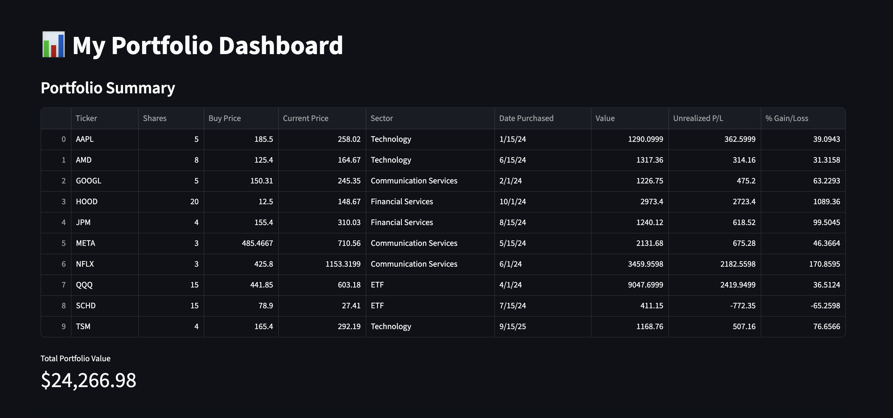
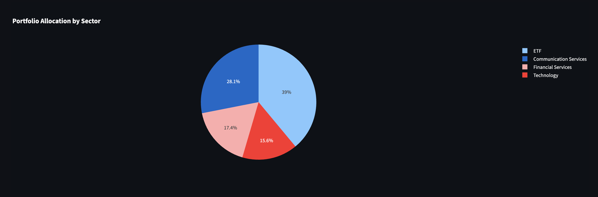
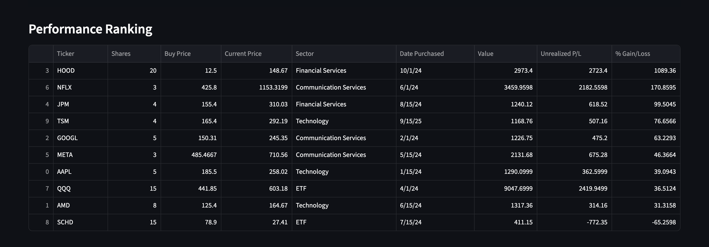
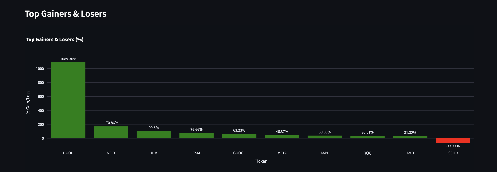
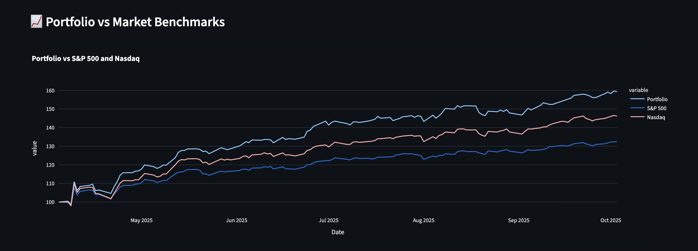
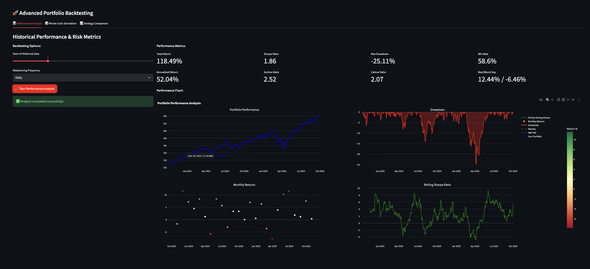
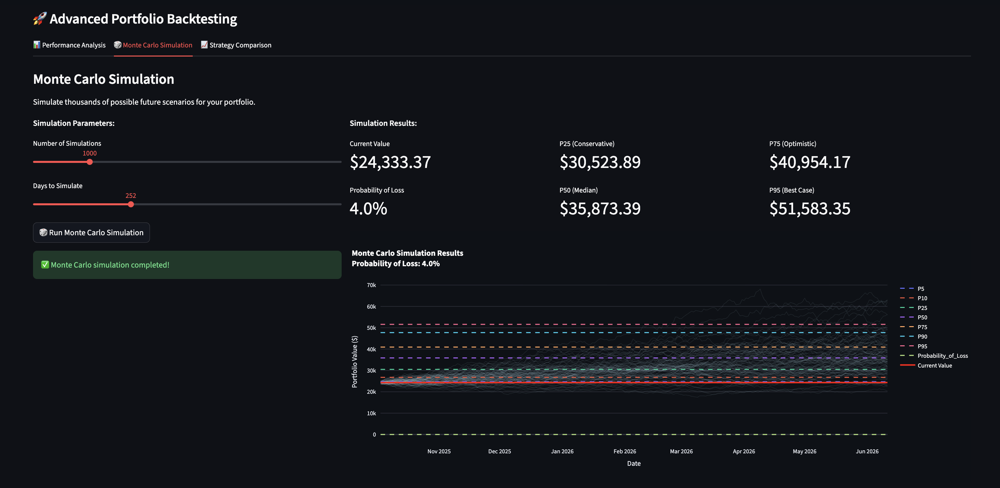
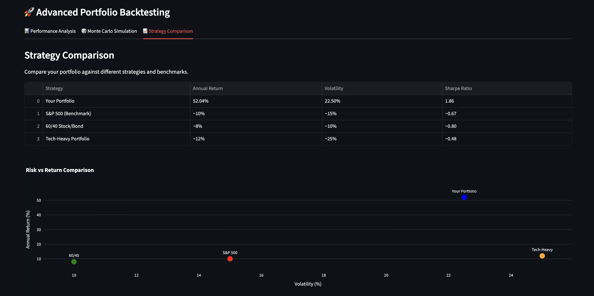

# 📊 Advanced Portfolio Dashboard

A comprehensive **Streamlit-based portfolio management dashboard** with real-time market data, advanced backtesting capabilities, and Monte Carlo simulation features.

## 🚀 Features

### 📈 Real-Time Portfolio Tracking
- Live price updates via Yahoo Finance API
- Portfolio allocation by ticker and sector
- Performance metrics and P&L tracking
- Top gainers/losers analysis

### 🎯 Advanced Backtesting Engine
- Historical performance analysis with multiple risk metrics
- Portfolio vs benchmark comparison (S&P 500, Nasdaq)
- Monte Carlo simulation for future scenario planning
- Strategy comparison tools

### 📊 Interactive Visualizations
- Portfolio allocation pie charts
- Performance vs benchmark line charts
- Risk-return scatter plots
- Drawdown analysis
- Rolling Sharpe ratio tracking

### 🔧 Data Processing Pipeline
- Automated Robinhood CSV data cleaning
- Transaction aggregation and portfolio calculation
- Sector classification and ETF detection
- Error handling for missing data

## 🛠️ Technology Stack

- **Frontend**: Streamlit
- **Data Processing**: Pandas, NumPy
- **Visualization**: Plotly
- **Market Data**: Yahoo Finance (yfinance)
- **Backtesting**: Custom portfolio backtesting engine

## 📋 Requirements

streamlit>=1.50.0
pandas>=2.3.0
plotly>=6.3.0
yfinance>=0.2.60
numpy>=2.3.0


## 🚀 Quick Start

### 1. Clone the Repository
```bash
git clone https://github.com/jpansuriya/portfolio-dashboard.git
cd portfolio-dashboard
```

### 2. Set Up Virtual Environment
```bash
python -m venv venv
source venv/bin/activate
```

### 3. Install Dependencies
```bash
pip install -r requirements.txt
```

### 4. Prepare Your Data
- Export your Robinhood transaction history as CSV
- Place it in the project directory
- Update `clean_robinhood.py` to point to your CSV file
- Run the data cleaning script:
```bash
python clean_robinhood.py
```
- This creates `Portfolio.csv` with your current holdings and live prices

### 5. Run the Application
```bash
streamlit run app.py
```

## 🚀 Demo Screenshots

Here are some highlights of the dashboard in action:

### 📋 Portfolio Summary


### 📊 Allocation by Ticker


### 📊 Allocation by Sector


### 🏆 Performance Ranking


### 📈 Top Gainers & Losers


### 📊 Portfolio vs Market Benchmarks


### 📉 Backtesting: Performance & Risk Metrics


### 🎲 Monte Carlo Simulation


### ⚖️ Strategy Comparison



## 📁 Project Structure

portfolio-dashboard/
├── app.py # Main Streamlit application
├── portfolio_backtesting.py # Advanced backtesting engine
├── clean_robinhood.py # Data cleaning and processing
├── sample_robinhood_data.csv # Sample transaction data
├── Portfolio.csv # Generated portfolio holdings
├── requirements.txt # Python dependencies
└── README.md # Project documentation


## 🎯 Key Components

### Main Dashboard (app.py)
- Portfolio overview with live prices
- Allocation charts and performance metrics
- Benchmark comparisons
- Interactive backtesting interface

### Backtesting Engine (portfolio_backtesting.py)
- PortfolioBacktester class for comprehensive analysis
- Risk metrics: Sharpe ratio, Sortino ratio, Max drawdown
- Monte Carlo simulation for scenario planning
- Performance visualization tools

### Data Processor (clean_robinhood.py)
- Automatically processes Robinhood CSV exports
- Aggregates buy/sell transactions into current holdings
- Fetches current prices and sector information
- Handles dividends, splits, and corporate actions

## 📊 Sample Data

The project includes sample_robinhood_data.csv with realistic transaction data for testing. This includes:
- 30+ transactions across popular stocks (AAPL, GOOGL, MSFT, TSLA, etc.)
- Buy/sell transactions with realistic prices
- Dividend payments
- ETF purchases (QQQ, SPY, SCHD)

## 📈 Performance Metrics

The dashboard calculates comprehensive risk and return metrics:

- **Total Return**: Overall portfolio performance
- **Annualized Return**: Yearly return rate
- **Sharpe Ratio**: Risk-adjusted returns
- **Sortino Ratio**: Downside risk-adjusted returns
- **Maximum Drawdown**: Largest peak-to-trough decline
- **Calmar Ratio**: Return to max drawdown ratio
- **Win Rate**: Percentage of positive return periods

## 🤝 Contributing

1. Fork the repository
2. Create a feature branch
3. Commit your changes
4. Push to the branch
5. Open a Pull Request

## 📝 License

This project is licensed under the MIT License.

---

⭐ Star this repository if you found it helpful!